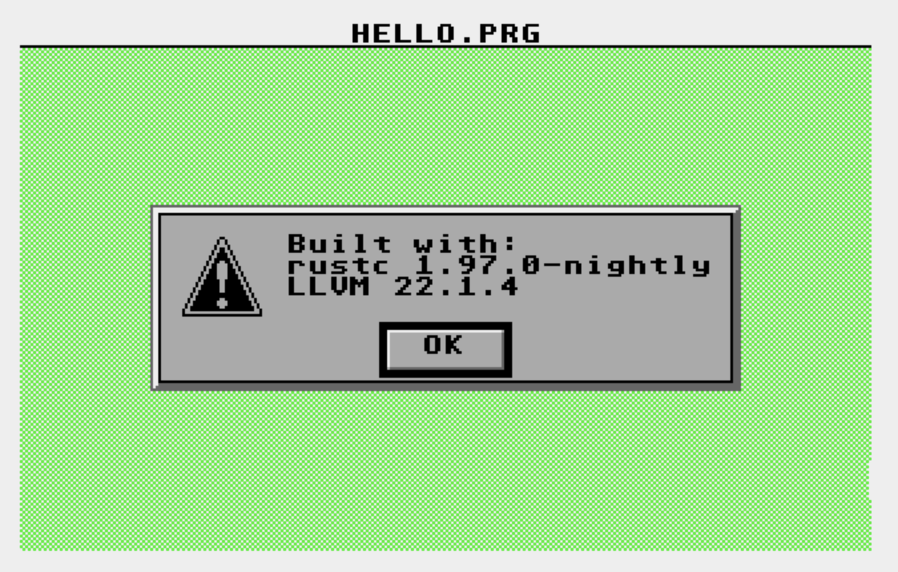

# RuST

Minimal Rust "hello world" for Atari TOS / EmuTOS on m68k. Builds to `HELLO.PRG`.

Requires on `PATH`:

- Rust nightly with `rust-src` (pinned in `rust-toolchain.toml`)
- m68k-elf [binutils](https://www.gnu.org/software/binutils/) (`m68k-elf-ld`)
- [toslibc](https://github.com/frno7/toslibc)'s `toslink` (creates the final `.prg`)

